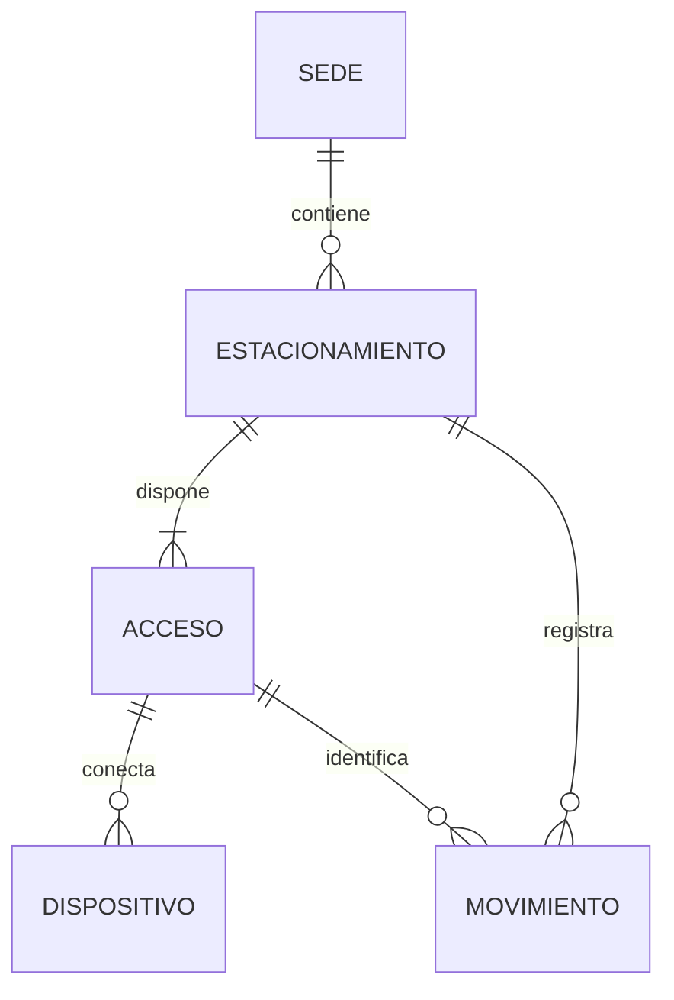

# Modelo y arquitectura APF2

Una sede puede tener varias zonas. Cada zona recibe exactamente dos accesos al crearla: entrada y salida. Dispositivo queda preparado, sin CRUD ni hardware en esta entrega. Cada movimiento tiene evento UUID único, acceso, tipo, origen, placa opcional y hora del servidor.

Ocupados = entradas confirmadas - salidas confirmadas. Disponibles = capacidad - ocupados. Todos los cambios de capacidad y movimientos bloquean la misma fila de estacionamiento antes de comprobar las reglas; el bloqueo se mantiene hasta commit/rollback. El historial restringe la eliminación.

Las relaciones y restricciones están en `src/main/resources/schema.sql`. Las PK de Sede siguen siendo String para conservar los IDs de la API del APF1; los IDs nuevos son BIGINT generados por la base.

Pendiente del APF2: Usuario, roles, Spring Security y JWT, a cargo de Ricardo. Futuro: Vehículo con placa única; Estadía para emparejar ingreso/salida por vehículo; EventoSensor con incidencias, secuencia del dispositivo y reconciliación. Un evento anónimo de sensor no debe fingir una identificación de placa.

## Flujo de creación

JSP con Bootstrap -> ParkingWebController -> EstacionamientoDto validado -> EstacionamientoService transaccional -> EstacionamientoDao -> repositorios JPA -> Hibernate -> PostgreSQL. La creación de la zona y sus accesos se confirma junta.

## Flujo JSF

sedes.xhtml -> SedeBean (request scope) -> SedeDto -> SedeService -> SedeDao -> SedeRepository -> Hibernate -> PostgreSQL. Los componentes JSF validan el formulario; la base garantiza unicidad.

## Continuidad APF1

Se mantienen Java 21, Spring Boot 3.2.5, API /api/sedes y capas por constructor. Los DAO de sede y estacionamiento ahora adaptan repositorios JPA; el historial usa el repositorio JPQL de Sergio. Se cambia a WAR para JSP y se incorpora JSF; no son proyectos separados. La copia del ZIP original permanece intacta. Las pruebas actuales usan la nueva persistencia real y no reutilizan pruebas de getters como evidencia de Service.
